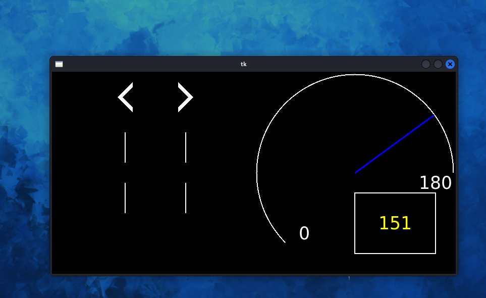

# car_bus_security_simulator
汽车总线安全模拟器

## 效果
参考 [ICSim](https://github.com/zombieCraig/ICSim) ,编写python版本的CAN总线模拟器,并新增部分CAN消息类型



## 安装运行
Linux安装can相关工具
```shell
sudo apt-get update
sudo apt install can-utils -y
```

运行初始化虚拟CAN接口
```shell
sudo modprobe can
sudo modprobe vcan
sudo ip link add dev vcan0 type vcan
sudo ip link set up vcan0
```

下载[二进制文件](https://github.com/Cl0udG0d/car_bus_security_simulator/releases)
```shell
chmod 777 cbss
./cbss
```
## 功能对应表
键盘操作

| **功能**     | **按键**      |
|------------|-------------|
| 加速         | 上方向键        |
| 减速         | 下方向键        |
| 左转向        | 左方向键        |
| 右转向        | 右方向键        |
| 开/关左车门（前）锁 | 6/1  |
| 开/关右车门（前）锁 | 7/2  |
| 开/关左车门（后）锁 | 8/3  |
| 开/关右车门（后）锁 | 9/4  |
| 开启所有车门锁    | 5 |
| 关闭所有车门锁    | 0 |
| DOS攻击      | 发送仲裁ID 000的全0数据 |

